# Linux komutları

## _Dosya/dizin ile ilgili komutlar_
- cat
- more
- less
- head
- tail
- cd
- mkdir
- mv
- cp
- rm
- touch

<br/><br/><br/>

### 1) CAT

Cat komutu dosya içeriğini, terminal ekranından okumamızı sağlayan komuttur.
Cat komutunun, bu işlemin yanı sıra başka yararları da mevcuttur. Bunlara da değineceğim.


Örneğin; Linux terminalinde deneme.txt dosyasını oluşturup içine bir veya daha çok metin satırı ekleyelim ve Ctrl+C veya Ctrl+D ile çıkalım:
```shell
$ cat > deneme.txt
dosyanın içine
bu satırları yazıyorum
^C
```
- komutu ortamda deneme.txt dosyası olsa da olmasa da önce dosyayı oluşturur ardından içine yazı yazabilmemizi sağlar.
 
 `cat deneme.txt` komutu ile dosyayı okuyalım.
 
- Aynı şekilde birden fazla satırı Ctrl karakteri ile işaretler göndererek yazmamak için aşağıdaki şekilde EOF (End Of File) kullanabiliriz:

```shell
$ cat << EOF >> deneme.txt
dosyanın içine
bu satırları yazıyorum
EOF
```
 <p align="center">
  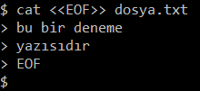
</p>


- Eğer ortamda önceden oluşturulmuş `deneme.txt` dosyası bulunuyorsa `cat > deneme.txt` komutu, önceki deneme.txt dosyasının içindeki verileri siler ve yazacağımız yeni verileri deneme.txt dosyasına yazmamızı sağlar.
- Eğer dosyanın üzerine yazmak istiyorsak **`cat >>deneme.txt`** komutunu kullanmamız gerekir. Bu şekilde eski veriler de yeni veriler de tutulmuş olur.
Bu yere kadar olan komutların terminaldeki örneklerini aşağıdaki görselde bulabilirsiniz.

<p align="center">
  
</p>

- Yukarıdaki görselde önce cat ile deneme.txt dosyasını okuduk ve "deneme1" metniyle karşılaştık. Sonra
- `cat >deneme.txt` komutu ile içerisine "deneme2" yazısını ekledik. Bu dosyayı tekrar okuduğumuzda önceki metnin "deneme1" gittiğini gördük.
- Daha sonra `cat >>deneme.txt` komutu ile "deneme3" yazdık ve bu komutun çıktısını okuduğumuzda, önceki metnin("deneme2") kaybolmadığını, üzerine yazıldığını gördük.


</br>

- Konsolda bir dosyanın içeriğini görüntülemek yerine, sonucu ">" kullanarak başka bir dosyaya yönlendirebilirsiniz. Komut satırı böyle olacaktır:
```shell
$ cat kaynak.txt > hedef.txt
```
-Eğer, hedef dosya bulunmuyorsa o zaman komut bu dosyayı yaratacak veya var olan dosyanın üzerine yazacaktır.

- Cat ile ilgili bir başka komut ise, mevcut konumdaki bütün metin dosyalarının içeriğini görüntülemek için kullandığımız komut. Bunun için aşağıdaki komutu terminal’de kullanın:
```shell
 $ cat *.txt
 ```

- Cat komutu satır sonlarını, "$" karakterini her satırın sonunda görüntüleyerek işaretleyebilir. Bu özelliği kullanmak için cat komutuyla birlikte -E seçeneğini kullanabiliriz.
```shell
$ cat -E dosyaadi.txt
 ```

- Cat komutuyla bir dosyanın içeriklerini her satırın başında rakamlarla (satır numaralarıyla) görüntüleyebilirsiniz. Bu özelliği kullanmak için cat komutuyla birlikte -n seçeneğini kullanın:
 ```shell
$ cat -n dosyaadi.txt
```
 <p align="center">
  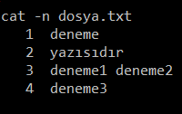
</p>


-Cat komutuyla ilgili daha fazla bilgi için cat’in kılavuz sayfasına man cat komutu ile ulaşabilirsiniz.


<br/><br/><br/>
### 2) More
- more komutu cat ile aynı ile vazifelidir. Ancak more komutunun bir avantajı, tek sayfada gösterilemeyecek olan dosyalar okunurken, boşluk tuşu ile kaydırma olanağı sağlamasıdır.
- 
#### Syntax;

**_more `file_path`_** 

- Ek olarak more komutu;
```shell
 $ more +5 dosya.txt
 ```
şeklinde kullanılırsa 5’inci satırdan itibaren dosya içeriğini çekmemizi sağlar.

```shell
 $ more +/”kelime” dosya.txt
  ```
 şeklinde kullanılırsa belirtilen kelime ile başlayan satırı çekmemizi sağlar.
 
 
  <p align="center">
  
</p>

 
<br/><br/><br/>
 
 

### 3) Less
- Less komutu da more komutu gibi terminal ekranına sığmayacak büyüklükteki text dosyalarını sayfa sayfa göstermeye yarar fakat birkaç farkla. 
- Örneğin less, more'un aksine kullanıcının bir önceki sayfaya dönmesi ve birçok başka özelliğe imkan tanır. 

1. 	Less içerik içinde ileri - geri yönlü hareket edebilirken, more ile sadece ileri yönlü hareket edilebilir
2.  Less tüm dosya içeriğini belleğe almadığı için büyük dosyaları okumak için daha uygundur
3.	 Less more'a göre daha gelişmiştir (metin içinde arama, zip dosyasını okuma vb..) ve more yerine artık less tercih edilmektedir.


•"G" : basarsak sayfa sonuna gider.

•"g" : basarsak sayfa başına gider.

•“16g” : ile 16.satıra gider.

•“u” : sayfa yarı yukarı

•“d” : sayfa yarı aşağı

•“k” : bir satır yukarı

•“j” : bir satır aşağı

 
<br/><br/><br/>
 
 
 
### 4) Head

- Bir metin dosyasının ilk birkaç satırını görüntülemek için kullanılır. Örnek:
```shell
$ head dosya.txt
```
- Varsayılan değeri 10'dur. Ancak istenilirse bu değer değiştirilebilir. Örneğin;

```shell
$ head -n 5 dosya.txt
```
- Yukarıdaki kod örneğimizde, dosyanın başından itibaren 5 satır görüntülenir. 

<p align="center">
  
</p>

- Görseldeki örnekte ilk önce;
- cat ile test-data.csv dosyası açılıyor.
- Sonra head komutu ile ilk 2 satırı çekiliyor.
- Sonra bunun çıktısı "|" aracılığı ile tail'e gönderiliyor. Ve tail'de bu çıktının son 1 satırını çekiyor (tail komutunu aşağıda anlatacağım).
- Sonuç olarak 1;Adam;32 outputu elde ediliyor. 

<br/><br/><br/>


### 5) Tail

Bir metin dosyasının son birkaç satırını görüntülemek için kullanılır. Örnek:
```shell
$ tail dosya.txt
```
- Head gibi tail komutu için de varsayılan değer 10'dur. Ancak istenirse bu değer değiştirilebilir. Örneğin:

```shell
$ tail -n 25 dosya.txt
```

- Yukarıdaki komutta aynı dosyanın sonundan itibaren 25 satır görüntülenir. Eğer dosyanın satır sayısı belirtilen sayıdan az ise (veya sayı belirtilmediğinde 10'dan az ise) dosyada olan kadar satır görüntülenir.

<br/> <p align="center">
  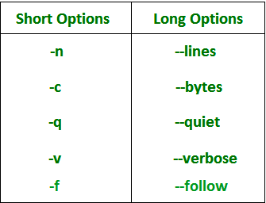
</p>


Tail komutuna yukarıdaki seçenekleri de ekleyerek, komutu daha spesifik işlemler için kullanabiliriz.

#### Syntax;

 **_tail [options] `files`_**  
 
1.  **-n** komutunu yukarıda örneklendirmiştik. Satır olarak sınırlayıp çıktıyı verir. Aşağıdaki komut örneği ile dosyanın son 5 satırı görüntülenir. 
 ```shell
$ tail -n 5 dosya.txt 
 ```
 
2.  **-c** komutu da dosya görüntülemeyi byte olarak sınırlayarak çıktıyı verir. Aşağıdaki komut örneği ile dosyadan son 5 byte görüntülenir.
 ```shell
$ tail -c 5 dosya.txt 
 ```
 
3.  **-q** komutu ile birden çok dosya kullanırken, dosya adlarının çıktısını gizleyebiliriz.
 ```shell
$ tail -q dosya.txt
 ```
4.  **-v** komutu -q komutunun tam tersine, dosya adlarının çıktısını verir.
 ```shell
$ tail -v dosya.txt
 ```
<p align="center">
  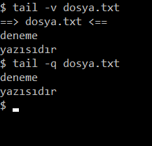
</p>

5. **retry** komutu : Eğer dosyaya erişim yoksa tekrar dener, dosya yeni oluşturulduğu durumlar söz konusu olabilir. Kontrol edilmesini sağlar.
 
6. **f** komutu dosyaya eklenen verilerin çıktısını verir. Yani dosya içeriğini canlı olarak gösterir. Biz dosyayı okurken, sürekli yeni eklemeler yapılıyorsa bunları canlı olarak görebilmemizi sağlar.
 
- Birim zaman başına çok sayıda erişim varsa bu yaklaşım pratik değildir. Bu durumda, günlük o kadar hızlı değişir ki terminal verilerle dolup taşar.
 
- Canlı kuyruğun geçerli yürütmesini iptal etmek içinse "Ctrl + C" tuşuna basılması gerekir.
```shell
$ tail -f dosya.txt
 ```
7. **--pid=PID** komutu
-f seçeneğiyle birlikte kullanıldığında, belirtilen işlem kimliğine sahip işlem(PID), sona erdiğinde tail komutu sonlandırılır. Dosya yazma programı sonlandırıldığında, canlı kuyruğu iptal etmek için kullanışlıdır.
 
```shell 
$ tail -f dosya.txt –pid=1
 ```

 
<br/><br/><br/>

 
 
### 6) Çalışma Dizinini Değiştirmek (cd) 
 
- Mevcut çalışma dizinini değiştirmek için cd(change directory) komutu kullanılır. Bu komut, kullanıcıların sistem dizinleri arasında gezinmesini sağlar. 

#### Syntax;
 
 **_cd `DIRNAME`_** 
 
- Mesela bulunduğumuz konumdan desktop konumuna geçmek istiyoruz. Bunun için aşağıdaki komutu girmemiz yeterlidir.
```shell 
$ cd /home/user/Desktop
 ```
- Yukarıdaki komutun eşdeğeri 
 
 ```shell 
 $ cd ~/Desktop
  ```
 komutudur. ” ~ “ işareti kök dizini gösterir yani /home/user/ dizinidir.
 
 1) cd ~ komutu /home/user dizinine gitmemizi sağlar.
 2) cd – komutu bir önceki bulunduğumuz dizine geçmemizi sağlar. 
 3) cd .. komutu /home dizinine geçer.

 
 
 
 

<br/><br/><br/>
### 7) Dizin Yaratmak (MKDIR)

- mkdir (make directory) yeni bir dizin oluşturmak için kullanılan komuttur. 
 
#### Syntax;
 
**_mkdir `dizin_adı`_** 
 
- Yukarıda yazıldığı gibi kullanıldığında yeni dizin şu anki dizinin içinde oluşturulur. 
 
- -p : (--parents) Eğer yoksa, gerekli üst dizinleri de oluşturur. Eğer bu dizinler zaten varsa bir hata iletisi göstermez. 
  -p 'nin kullanılmasına bir örnek: `mkdir -p /geçici/a/b/c`
 Eğer `/geçici/a` dizini zaten varsa fakat `/geçici/a/b` dizini yoksa, mkdir , `/geçici/a/b`'yi oluşturduktan sonra `/geçici/a/b/c` dizinini oluşturulur.

- -v : (--verbose) Oluşturulan her dizini ekranda gösterir. Çoğunlukla -p ile birlikte kullanılır.
- -m : Oluşturulan dizinin, erişim izinlerini belirler. Erişim izinleri ya sayısal olarak ya da r/w/x şeklinde belirtilmelidir. Genellikle bazı dizinlerin erişime engellenmesinde kullanılır.

- Aşağıdaki örnekte tam erişimli dosya yaratma işleminin komutlarını görebiliriz.
```shell  
$ mkdir -m 777 newDir
```
Ya da
 
 ```shell 
 $ mkdir -m=rwx <file> 
 ```
 komutlarını kullanabiliriz.
 
- Sadece <ins> okuma ve yazma </ins> işlemi için "mkdir -m=rw `file`"
 
- Sadece <ins>yazma </ins> işlemi için "mkdir -m=r `file`"
 
- Sadece <ins>okuma </ins> işlemi için "mkdir -m=w `file`"
 
- Sadece <ins>execute </ins> işlemi için "mkdir -m=x `file`"
 
 
 
 
 

<br/><br/><br/>
### 8) Dosya/Dizin Taşımak/Yeniden İsimlendirmek (mv)

`mv` (move) komutu dosya ve dizinleri yeniden adlandırmak ve/veya taşımak için kullanılabilir. 

 #### SYNTAX; 
 
**_mv [eski] [yeni]_** 
 
```shell
$ mv newDir ~/Documents/Dirs
```
 
Dosya adını değiştirmek için aşağıdaki komut kullanılır. 
 ```shell
$ mv newDir ChangedDir
 ```
newdir olan dosya adını ChangedDir dosya adına çevirir.
 
 
 
<br/><br/><br/>
 

### 9) Dosya ve dizinleri Kopyalamak (cp)
 
- Dosya ve dizinleri kopyalamaya yarayan bir araç komutudur. 
 
 ```shell
$ cp newDir ~/Documents/Dirs
 ```
- Komut, newDir dizininin içeriğini ~/Documents/Dirs içine kopyalayacaktır. newDir'in bulunduğu yerden kaldırılmayacağını unutmayın. Sadece kopyalanır.
  
- cp komutunun;
 
1. Bir dosyayı başka bir dosyaya kopyalamaya,
  <p align="center">
  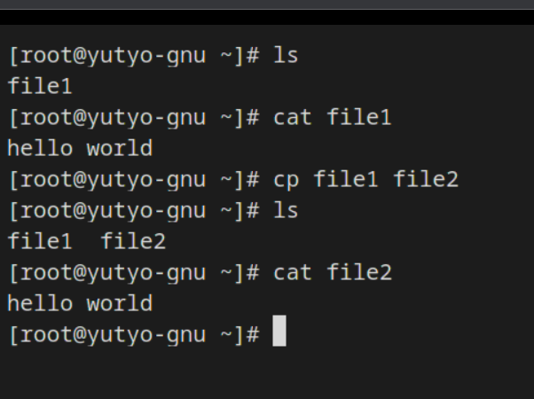
</p>
 
2. Birden çok dosyayı bir dizinin içine kopyalamaya veya
 
3. Bir dizinin içeriğini, tamamen başka bir dizinin içine kopyalamak gibi farklı işlevler görmesi için, yanına eklenen argümanlarla sağlanabilecek üç ana modu vardır;

a) Bir dosyayı başka bir dosyaya kopyalamak:
 ```shell
$ cp kaynakdosya hedefdosya
   ```
b)  Dosya veya dosyaları bir dizinin içine kopyalamak:
 ```shell
$ cp kaynakdosya... hedefdizin
   ```
c) Bir dizinin içeriğini başka bir dizinin içine kopyalamak (-r veya -R argümanları kullanılmak zorundadır):
 ```shell
$ cp -r|-R kaynakdizin hedefdizin
 ```
- Peki, bulunduğumuz dizindeki tüm *.sql uzantılı dosyaların oluşturulmuş /db_yedek isimli bir başka klasöre kopyalanmasını istersek;
 ```shell
$ cp *.sql db_yedek/
   ```
 cp'nin diğer kullanımlarına birkaç örnek ise -a -v ve -R parametreleridir.
 
- -a dosyaya ait file mode, ownership, timestamps ve eğer mümkünse attributes: context, links, xattr verilerini aktarır.
- -v işlemle ilgili süreci döker.
- -R ya da -r ; klasör yapısını olduğu gibi kopyalar. Dizin ağacındaki tüm dosyaları, yani bir dizin ve onun alt dizinindeki tüm dosyaları kopyalar.

 
 
 
 
<br/><br/><br/>
 
### 10) Dosya Kaldırmak (rm) 
 
- Artık ihtiyacımız olmayan dosyaları kaldırmak için rm komutunu kullanırız.
 
#### Syntax;
 
 **_rm `filename`_**
  
- Birden fazla dosyayı tek seferde kaldırmak istersek;
  ```shell
  $ rm dosya1 dosya2 dosya3  
  ```
- -f (Silmeyi Zorla): Bir dosya yazmaya karşı korumalıysa, rm onayın kaldırılmasını ister. -f seçeneği bu küçük korumayı geçersiz kılar ve dosyayı zorla kaldırır.
  
<p align="center">
  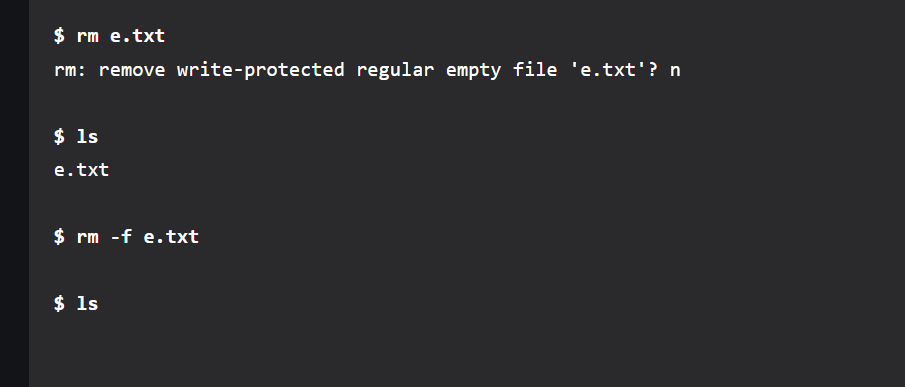
</p>
  
- -r komutu ile dosyanın içindeki ve onun tüm alt dizinindeki dosyaları siler.
 
<p align="center">
  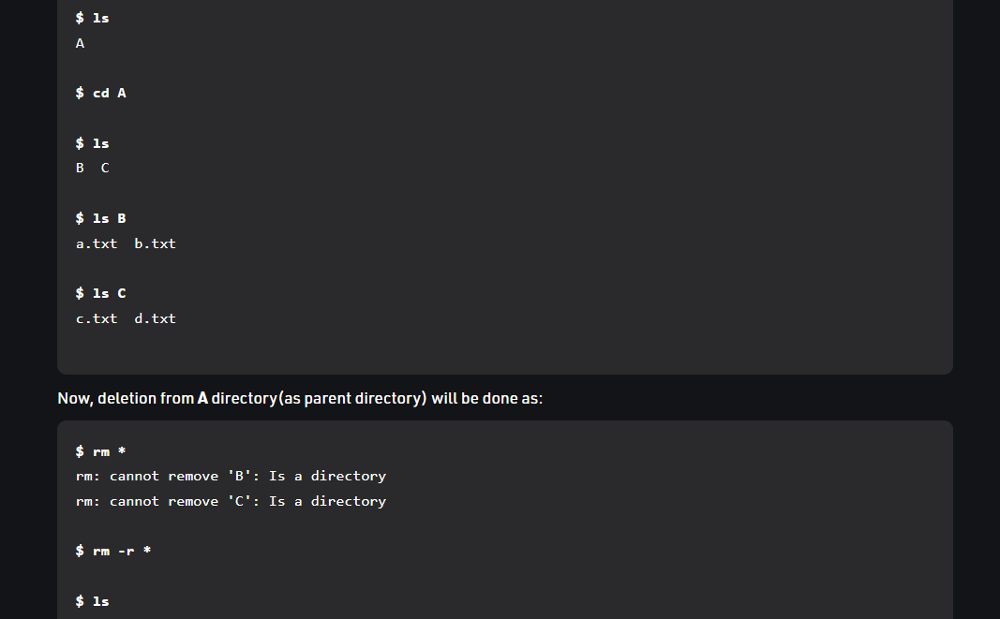
</p>
  
- rmdir -> boş klasörleri silmek için kullanılır. -p parametresi ile birlikte kullanılınca üst dizinleri de siler.
 
- rm -i -> interaktif modda çalışır ve sileceği her dosya için onay ister.
 
- rm -rf /*  -> root dizinini ve altındaki bütün dosyaları siler.

 
 
<br/><br/><br/>
 
### 11) Dosya Yaratmak (touch) 
 
- Touch komutu dosya yaratmak içindir.
 
#### Syntax;
 
**_touch `filename`_**
 
- Eğer bulunduğumuz dizinde oluşturmak istediğimiz dosya isimli dosya yok ise;
 --> Yeni bir dosya yaratır. 
- Dizinde aynı isimde dosya zaten bulunuyorsa;
 --> Sadece dosyanın oluşturulma zamanı(timestamp) güncellenir.

 <p align="center">
  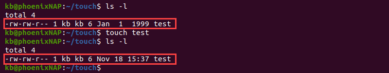
</p>
 
- Birden çok dosya yaratmak istersek dosya adlarını ard arda yazmamız yeterlidir.
```Shell
 $ touch dosya1 dosya2 dosya3
 ```
 
 ```Shell
 $ touch test{1..10} 
  ```
- Bu komut, 1’den 10’a kadar test dosyası yaratmamızı sağlar (test1 test2 test3 … test10)
   <p align="center">
  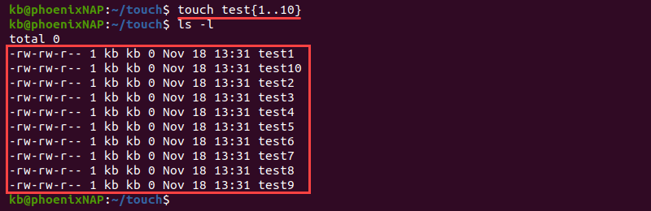
</p>
 
 ```Shell
 $ touch test_{a..j}
 ```
 
- Aşağıdaki komut ise, a’dan j’ye kadar test dosyası yaratmamızı sağlar (test_a test_b test_c … test_j)
 <p align="center">
  
</p>


<br/><br/><br/>


## _Genel Linux komutları_
- pwd,  
- whoami,
- whereis,
- whatis.


<br/><br/><br/>

### 1) Current(Şuanki) Dizini Öğrenme (pwd) 

pwd Linux komutu, kökten (/) başlayarak geçerli (o anki bulunan, current) çalışma dizini yolunu yazdırır.
```Shell
$ pwd
-> /home/user/Desktop
```


<br/><br/><br/>
### 2) whoami

- Bu komut çağrıldığında mevcut kullanıcının kullanıcı adını görüntüler.
<p align="center">
  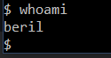
</p>


<br/><br/><br/>
### 3) whereis
- whereis, belirli bir komut için binary (ikili), source (kaynak) ve manuel sayfa dosyalarının konumunu bulmanızı sağlayan bir komut satırı yardımcı programıdır.
  
#### Syntax;

  **_whereis [SEÇENEKER]  `filename`_**
  
- Herhangi bir seçenek olmadan kullanıldığında, argüman olarak belirtilen komut için, binary (ikili), source (kaynak) ve manuel dosyalarını arar.

- Varsayılan olarak whereis, ortam değişkenlerinde listelenen sabit kodlanmış yollarda ve dizinlerde komutun dosyalarını arar.
  
- whereis komutunun aradığı dizinleri bulmak için -l seçeneğini kullanabiliriz (whereis -l).

Örneğin, CAT komutu hakkında bilgi almak için aşağıdaki komutu yazabiliriz.
```Shell
$ whereis cat
```
<p align="center">
  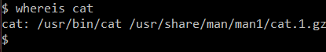
</p>

- /usr/bin/cat  binary (ikili) dosyanın yolu,
- /usr/share/man/man1/cat.1.gz ise man dosyasının yeridir.


- Ayrıca, whereis komutuna birden fazla argüman sağlayabilirsiniz.
<p align="center">
  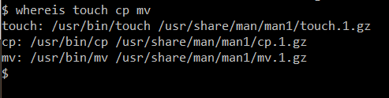
</p>

- Yalnızca komutun  binary (ikili) dosyalarını aramak için -b seçeneğini kullanabiliriz.
<p align="center">
  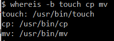
</p>

- Yalnızca source dosyaları için -s, yalnızca man dosyalarının yeri için -m seçeneğini kullanabiliriz.

- -u seçeneği, olağandışı girdilerin nerede aranacağını söyler. İstenen her türden, (binary (ikili), manuel ve kaynak) tam olarak bir girişi olmayan dosyalar, olağandışı dosyalar (komutlar) olarak kabul edilir.

- Örneğin, /bin dizinindeki kılavuz sayfaları olmayan veya birden fazla belgeye sahip tüm binary (ikili) dosyaları aramak için aşağıdaki komutu yazabiliriz.
```Shell
$ whereis -m -u *
```


### 4) whatis

- whatis komutu aranan içeriği kütüphane içerisinde arayarak sonucu ekrana yansıtır.
```Shell
$ whatis ping
```
<p align="center">
  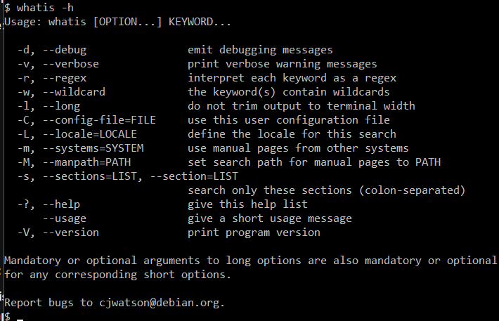
</p>


<br/><br/><br/>

## _Sıkıştırılmış dosya ile ilgili komutlar_ 
- tar,
- gzip,
- unzip 

<br/><br/><br/>

### 1) .tar
  
- Tar komutu, bir grup dosyayı bir arşive sıkıştırmak için kullanılır. Komut ayrıca tar arşivlerini çıkarmak, korumak veya değiştirmek için de kullanılır.
- Tar dosyaların veya klasörlerin özelliklerini değiştirmez. Sıkıştırma işlemi yapılırken izinler ve diğer özellikler sabit kalır.
  
#### Syntax:

**_tar [options] [archive-file] [file or directory to be archived]_**

<br/>
<ins> Options: </ins>
<br/>•-c : Creates archive (.tar file)
<br/>•-x : Extracts the archive
<br/>•-f : creates archive with given filename
<br/>•-t : displays or lists files in archived file
<br/>•-u : archives and adds to an existing archive file
<br/>•-v : Displays verbose information
<br/>•-A : Concatenates the archive files
<br/>•-z : compresses the tar file using gzip
<br/>•-j : compresses the tar file using bzip2
<br/>•-W : Verifies an archive file
<br/>•-r : updates or adds file or directory in already existing .tar file


#### a) Linux’da Bir .tar Arşiv Dosyası Oluşturma

```Shell
$ tar -cvf ornekArsiv.tar /home/ornekArsiv  
```
 -->Bu örnekte sıkıştırılması gereken dizin /home/ornekArsiv‘dir ve bunun sonucu olarak ornekArsiv.tar oluşacaktır.
 
```Shell
$ tar cfv archive.tar file1 file2 file3
```
--> dosyalardan (file1, file2, file3) arşiv yaratır.

```Shell
$ tar cfv archive.tar *.txt 
```
-> Geçerli dizindeki tüm .txt dosyalarının sıkıştırılmamış bir arşivini oluşturur.


<br/>

#### b) .tar.gz Dosyası Oluşturma:

```Shell
$ tar -cvzf ornekArsivArchive.tar.gz /home/ornekArsiv
```

#### c) Alternatif olarak .tar.gz dosyasına oldukça benzer olan .tgz dosyası oluşturabilirsiniz. Bunun bir örneğiyse:

```Shell
$ tar -cvzf ornekArsiv.tgz /home/ornekArsiv
```

#### d) tar.bz2 Dosyası Oluşturma:
- .bz2 dosyası gzip’e kıyasla daha fazla sıkıştırılma sağlar. 
- Ancak, sıkıştırma ve sıkıştırma işlemini geri almak daha uzun sürecektir. Bunu oluşturmak için -j seçeneğini kullanmanız gerekir. Bu işlemin bir örneğiyse:

```Shell
$ tar -cvjf ornekArsiv.tar.bz2 /home/ornekArsiv
```

#### e) .tar Dosyalarını Açma
- Linux tar komutu ayrıca bir dosyanın içindekileri çıkarmak için kullanılabilir. Aşağıdaki komut dosyaları mevcut dizine çıkaracaktır:

```Shell
$ tar -xvf Arsiv.tar 
```
-> (Options: x = extract, f = file, v = verbose)

- Eğer dosyaları farklı bir dizine çıkarmak istiyorsanız -C seçeneğini kullanabilirsiniz. Bunun bir örneğiyse aşağıdaki gibidir:

```Shell
$ tar -xvf ornekArsiv.tar -C /home/ExtractedFiles/

```

- Arşiv oluşturulduktan sonra tek bir dosya çıkartabilirsiniz. Bunun bir örneği aşağıdaki gibidir:

```Shell
$ tar -xvf ornekArsiv.tar example.sh
```
  
-  Eğer birden fazla dosya çıkarmak istiyorsanız aşağıdaki formatta bir komut kullanın:

```Shell
$ tar -xvf ornekArsiv.tar "file1" "file2"
```


#### f) Arşiv oluşturulduktan sonra içerikleri aşağıdakine benzer bir komut kullanarak listeleyebilirsiniz:

```Shell
$ tar -tvf ornekArsiv.tar 
```
--> arşivdeki tüm dosyaları gösterir.


#### g) Belirli türden dosyaları çıkarabildiğiniz gibi var olan bir arşive dosya da ekleyebilirsiniz. Bunu yapmak için karşılığı append olan -r seçeneğini kullanmalısınız. Tar hem dosya hem de dizin ekleyebilir.

- Var olan ornekArsiv.tar‘a example.jpg dosyasını eklediğimiz örnek:
```Shell
$ tar -rvf ornekArsiv.tar example.jpg
```


<br/><br/><br/>

### 2) unzip

Sıkıştırılmış zip dosyalarını çıkartır (extract). 
#### Syntax;

```Shell
$ unzip file.zip
```


<br/><br/><br/>

### 3) .gzip
- Gzip, bir dosyanın boyutunu azaltmanıza ve orijinal dosya modunu, sahipliği ve zaman damgasını korumanıza izin veren en popüler sıkıştırma algoritmalarından biridir. 
- 
#### Syntax;

<br/>
```Shell
$ gzip filename 
```
a)Yukarıdaki komut ile filename dosyasının sıkıştırılmış dosyası oluşturulur ve eski(sıkıştırılmamış) dosya silinir.

b) Eğer önceki dosyanın da korunmasını istiyorsak ; 

```Shell
$ gzip -k filename
```
- Ya da,
```Shell
$ gzip -c filename > filename.gz  
```
komutları ile eski dosyayı koruyabiliriz.

c) Dizindeki tüm dosyaları sıkıştırmak istersek;
```Shell
$ gzip -r directory
```

d) Çoklu dosya sıkıştırma  
```Shell
$ gzip file1 file2 file3
 ```
e)  Decompressing 

- "gzip" ile, .gz dosyasını çıkartmak için (extract), -d seçeneği kullanılır:

```Shell
$ gzip -d filename.gz
```

- Diğer bir seçenek ise “gunzip”. 
```Shell
$ gunzip filename.gz
```
  
  
  
  <br/><br/><br/><br/>
  
## _Network(ağ) ile ilgili komutlar_
- netstat, 
- nslookup,
- netcat 
  
  
  <br/><br/><br/>
  
### 1)netsat

-Netstat, sistem yöneticileri tarafından ağ yapılandırmasını ve etkinliğini değerlendirmek için kullanılan bir komut satırı aracıdır.

<br/>

a) 
```Shell
$ netstat -a | more
```
--> dinlenen ve dinlenmeyen tüm soketleri gösterir.

b)
```Shell
$ netstat -at 
```
-->tüm TCP portlarını listeler.

c)
```Shell
$ netstat -au 
```
-->tüm UDP portlarını listeler.

d)
```Shell
$ netstat -l 
```
--> Sadece dinlenen portları listeler.

e)
```Shell
$ netstat -lt 
```
--> sadece dinlenen TCP portlarını listeler.

f)
```Shell
$ netstat -lu
```
--> sadece dinlenen UDP portlarını listeler.

g)
```Shell
$ netstat -s 
```
--> tüm portların istatistiklerini listeler.

h)
```Shell
$ netstat -r 
```
--> Kernel routing (yönlendirme) bilgilerini listelemek için kullanılır.

i)
```Shell
$ netstat -i 
```
--> Ağ arayüzlerini (network interfaces) listeler.

j)
```Shell
$ netstat -e  
```
--> Ethernet İstatistiklerini Gösterir.

  <br/><br/><br/>

### 2) nslookup

- (name server lookup ) Alan adı ve IP adresi eşleşmesi bulmak veya DNS kayıtlarını sorgulamak/incelemek için kullanılabilen bir komut satırı aracıdır.


a) Aşağıdaki komut microsoft.com’un IP ‘sini sorgular;
```Shell
$ nslookup microsoft.com
```
- Alan adı yerine IP adresini vererek yukarıdaki işlemi tersten de yapabiliriz. Örneğin, komut:
```Shell
$ nslookup 134.170.185.46
```
b) Aşağıdaki komut microsoft.com’un mail servisini sorgular.
```Shell
$ nslookup -query=mx microsoft.com
```
c) Aşağıdaki komut microsoft.com’un nameserverlarını sorgular;
```Shell
$ nslookup -type=ns microsoft.com
```
d) Aşağıdaki komut SOA kaydını sorgular;
```Shell
$ nslookup -type=soa microsoft.com
```


 <br/><br/><br/>
### 3) netcat

- Netcat’in komut halini “nc” olarak kullanıyoruz. Bu komutun temel amacı networkler arasındaki veri okuma / yazma işlemlerine dair işlemlerdir.

#### Netcat’in Temel SYNTAX’ı:

**_$ nc [options] host port_**

- Host: Hedefin IP adresidir.
- Port: Hedefin port numarası ya da numaralarıdır. Yani birden fazla port dinlenebilir.
- Options:

-l  --> (listen mode) dinleme modu

-L   --> (Listen harder) Netcat’in sadece windows için hazırlanan sürümlerinde geçerlidir. Client tarafı connection’ı sonlandırsa bile dinleme modunu tekrar başlatır. 
Böylece Netcat’i ısrarlı bir dinleyici haline getirmiş olur.

-u  -->  (UDP mode) ön tanımlı olarak TCP gelir. Bunun yerine UDP kullanmak için bu opsiyonu kullanabiliriz.

-p  --> (Local port) Listen modundayken dinlenen portun, client modundayken tüm paketlerin gönderileceği kaynak portun belirtildiği opsiyondur.

-e  -->  Eğer connection olursa sonrasında program çalıştığında STDIN ve STDOUT ile iletişim kurmak için kullanılan opsiyondur

-n  -->  DNS lookup’larda diğer tarafın makinelerinin isimlerinde değişikliklik/oynama olamaması için kullanılacak opsiyon.

-z  -->  Zero-I/O modudur. Herhangibir datanın yollanmamasıdır. Sadece payload dışında bir paketin yollanması için kullanılan opsiyondur

-wN  -->  Connection’ın timeout olması yani süresinin dolması halinde STDIN kapandıktan sonra N saniye daha beklenir. Bir Netcat client ya da listener’ı bu opsiyon ile yeni bir connection açmak için N saniye bekleyecektir. Eğer bu süre içinde yeni bir connection oluşmazsa Netcat çalışmayı durduracaktır.

-v  --> (Be verbose) Connection sırasında Standard Error’da olan mesajların ayrıntılı biçimde yazılmasını söyleyen opsiyondur.

-vv  -->  (Be very verbose) Standard Errror’da -v opsiyonundan daha fazla detaylı yazılmasının söylendiği opsiyonel durumdur.

– <ins> Temel Netcat Client: </ins>

```Shell
$ nc [Hedef IP adresi] [Port]
```
Burada client modda hedef IP üzerindeki istenilen portta bir connection başlatmış oluruz.

– <ins> Temel Netcat Listener </ins>
```Shell
$ nc -l -p [Local Port]
```
- Burada listener modunda istenilen yerel portta, bir Netcat Listener’ı oluşturmuş oluruz.
- Hem client hem de listener modda veri STDIN’den alınır ve network’den STDOUT’a verilir.


<br/><br/><br/><br/>
## _Kullanıcı işlemleri ile ilgili komutlar_ 

- chmod,
- chown, 
- useradd,
- passwd
<br/><br/><br/>


### 1) chmod (Change mode)

- Linux sistemlerde kullanıcıların dosyalara erişim haklarını belirlemek için “chmod” komutu kullanılınır. Chmod un tam karşılığı change moddur.
- Chmod erişim izinleri herzaman rwx şeklinde sıralanmaktadır.

a) r – Okuma izni ( Read permission )
b) w – Yazma izni ( Write permission )
c) x – Çalıştırma izni ( Execute permission )


#### <ins> Bazı chmod örnekleri : </ins>

- rwx  ---> Okuma, yazma ve çalıştırma erişim izinlerinin hepsi var.
- rw-  ---> Okuma ve yazma izinleri var, çalıştırma için izin yok.
- r-x  ---> Okuma ve çalıştırma izinleri var, yazma için izin yok.
- -wx  ---> Okuma için izin yok, yazma ve çalıştırma izinleri var.
- r–   ---> Sadece okuma hakkı var.
- -w-  ---> Sadece yazma hakkı var.
- –x   ---> Sadece çalıştırma hakkı var.
- —    ---> Hiçbir erişim hakkı yok.

####  <ins> Dosya tür çeşitlerini şu şekilde sıralayabiliriz :  </ins>

- " * " : Normal bir dosya
- " d " : Dizin
- " b " : Özel blok dosyası
- " c " : Özel karakter dosyası
- " l " : Sembolik bağlantı dosyası
- " P " : Özel isimlendirilmiş pipe dosyası

####  <ins> Chmod izinleri için Operatörler </ins>

- "–" : İzinleri kaldır ( remove chmod permission )
- "+" : İzinleri ekle ( add chmod permission )
- "=" : İzinleri koy ( set chmod permission )

Örneğin;
```Shell
$ chmod +r deneme 
``` 
- deneme dosyasına okuma(r) izni vermiş olduk.

```Shell
$ chmod go+r deneme* 
```
- ( * ) joker parametresi ile deneme ile başlayan tüm dosyaların grup ve diğer(other) userler tarafından okunması iznini verir.


<br/><br/><br/>

### 2) chown (Change owner)

- Dosya Sahibini veya grubunu değiştirmek için "chown" komutu kullanılır.

- Chown komutu ile yaptığımız değişiklikleri, terminale **_"ls -l"_** yazarak kontrol edebiliriz.

1) Bir dosyanın sahipliğini değiştirmek için temel komut:

**_$chown kullanici dosyaadi_**

- chownOrnegi.txt (kök sahipliğine sahip) için, sahipliği kökten, user adlı başka bir kullanıcıya değiştirmenize izin verir. Bu komutun bir örneği aşağıdaki gibidir:

```Shell
$ chown user chownOrnegi.txt 
```

2) Komut, grubu değiştirmek için de düzenlenebilir. Sahipliği ve grubu değiştirmek için temel formatsa:
```Shell
$ chown kullanici[:grup] dosyaadi
```

a) Eğer aynı dosyayı (chownOrnegi.txt) user adlı sahibe ve grup1 adlı grupla değiştirmek istersek o zaman komut da böyle olacaktır:
```Shell
$ chown user: grup1 chownOrnegi.txt
```

b) Eğer yalnızca grup değiştirilecekse sahipliği atlayabilirsiniz. Örnek olarak komut satırına bu komutu girebiliriz:
```Shell
$ chown :grup1 chownOrnegi.txt
```

3)  Tıpkı dosyalar gibi dizinler için de sahipliği ve grubu değiştirebilirsiniz. Bu komutun bir örneği aşağıdaki gibidir:
```Shell
$ chown user /TestUnix
```
4) Chown komutunun yinelemeli kullanımı, tüm dizin ve alt dizinlerin sahipliğini veya grubunu değiştirebilir.

- Yinelemeli bir kullanım içinse -R seçeneğini kullanmanız gerekir. İşte bu komutun bir örneği:
```Shell
$ chown -R [KULLANICI][:GRUP] Dizin
```
- Eğer TestUnix olarak çok alt dizinli bir dizine sahipseniz aşağıdaki komut bütün dizinlerin ve alt dizinlerin sahipliğini user kullanıcısına verecektir.
```Shell
$ chown -R user /TestUnix
```

5) Ayrıca sembolik veya soft linkler üzerinde de chown komutu kullanılabilir. Sembolik bir bağlantı, mevcut bir fiziksel dosyaya referanstır. ln komutu soft linkler oluşturmak için kullanılır. chownOrnegi.txt adlı dosya içinse aşağıdaki gibi bir sembolik link oluşturulabilir:
```Shell
$ ln -s chownOrnegi.txt symlink  
```
- Chown komutunu ise linkler üzerinde aşağıdaki gibi kullanabiliriz:
```Shell
$ chown user symlink
```


<br/><br/><br/>


### 3) useradd

- Linux makinenizi birden fazla kişi kullanıyorsa veya birden çok kullanıcıya erişim sağlayan bir sunucuyu yönetiyorsanız, kullanıcı oluşturmak için useradd komutu gereklidir. 

#### Syntax;

**_$sudo useradd [options] USERNAME _**
!Önemli: sudo her dağıtımda yüklü değil. Yüklü değilse, kullanıcı oluşturmak için uygun izinlere sahip bir hesaba giriş yapmanız gerekir.

Örneğin basit bir kullanıcı oluşturarak başlayalım; 
```Shell
$ sudo useradd test 
```
---> test isminde bir user ekledik.

- Useradd, herhangi bir seçenek olmadan çalıştırıldığında;
- /etc/default/useradd dosyasında belirtilen, varsayılan ayarları kullanarak yeni bir kullanıcı hesabı oluşturur. 
- Bu, test adında bir kullanıcı yaratacaktır, ancak bu sınırlı bir işlemdir ve ana dizini veya şifresi gibi başka yararlı şeyler yaratmaz!

- Bu nedenle, eğer varsayılan ana dizine sahip bir kullanıcı oluşturmak istiyorsak, aşağıdaki seçeneği kullanmak daha anlamlı olacaktır:
```Shell
$ sudo useradd -m test
```
-->Bu kullanıcının artık bir /home/test dizini var.

- Ana dizini de değiştirmek istersek, aşağıdaki komutu girebiliriz.
```Shell
$ sudo useradd -m -d /alternatif test
```


<br/><br/><br/>

### 4) passwd


- passwd komutunu kullanarak yukarıda oluşturduğumuz test kullanıcısı için bir parola eklersiniz:
```Shell
$ sudo passwd test 
```
Bu, sizden kullanıcı için bir şifre girmenizi isteyecektir.


<br/><br/><br/><br/>


 ## _IP ile ilgili komutlar_
- ifconfig,
- iptables,
- traceroute 
- ip a, 
- ip link,
- ip r, 
- ip n

<br/><br/><br/>


### 1) ifconfig

a) Argümansız “ifconfig” komutu, tüm aktif arayüz ayrıntılarını görüntüler. ifconfig komutu ayrıca bir sunucunun atanan IP adresini kontrol etmek için de kullanılır.
<br/><p align="center">
  
</p>

b) -a argümanıyla birlikte aşağıdaki ifconfig komutu, sunucudaki tüm etkin veya etkin olmayan ağ arabirimlerinin bilgilerini görüntüler. eth0, lo, sit0 ve tun0 için sonuçları görüntüler.
<br/> <p align="center">
  
</p>

c) Belirttiğiniz bir interface'in bilgilerini görüntüleyebilirsiniz (eth0 , eth1 vs.).
- Örneğin; 
```Shell
$ ifconfig eth0
```

d) Bir interface'i aktif etmek için ifconfig kullanabilirsiniz. Bunun için up parametresini kullanıyoruz. 
```Shell
$ ifconfig eth0 up
```

e) Tam tersi interface’i kapatmak içinse down parametresini kullanıyoruz.
```Shell
$ ifconfig eth0 down
```

f) Belirttiğimiz interface'e ip atamak için kullanabiliriz. 
```Shell
$ İfconfig eth0 172.16.25.125
```

g) Belirttiğiniz interface 'e subnet mask 'ı  atamak için kullanabiliriz.
```Shell
$ ifconfig eth0 netmask 255.255.255.224
```


h) Belirttiğiniz interface'e broadcast ip'i atamak için kullanabiliriz.
```Shell
$ ifconfig eth0 broadcast 172.16.25.63
```

i) Belirttiğiniz interface 'e ip , mask ve broadcast 'i tek satırda da verebiliriz.
```Shell
$ ifconfig eth0 172.16.25.125 netmask 255.255.255.224 broadcast 172.16.25.63
```


j) ifconfig yardımcı programı, alias özelliğini kullanarak ek ağ arabirimlerini yapılandırmanıza olanak tanır.Örneğin; eth0'ın alias ağ arabirimini eklemek için aşağıdaki komut kullanılır.

- ! Alias ağ adresinin aynı subnet maskesinde olduğunu lütfen unutmayın. Örneğin, eth0 ağ ip adresiniz 172.16.25.125 ise, alias ip adresi 172.16.25.127 olmalıdır.
```Shell
$ ifconfig eth0:0 172.16.25.127
```

- Alias network interface’i kaldırmak içinse aşağıdaki komutu girmeniz yeterlidir.
```Shell 
$ ifconfig eth0:0 down
```


<br/><br/><br/>


### 2) iptables

- Siber olaylardan korunmaya öncelikle kendi alacağımız tedbirler ile başlamalıyız. Dosya izinlerimizi kontrol etmeli, kullandığımız yazılımların güncel olup olmadığına kendimizin karar vermesi lazım. Network trafiğimizin de kontrolüne ilk aşamada kendi belirlediğimiz kuralların yazılması ile başlamalıyız.
-  Iptables komutu işte tam bu konuda bize yardımcı olan bir yapıdır. İşletim sistemlerinde dışarıdan gelebilecek zararlara karşı koruma sağlayan bazı yapılar bulunur. Bu yapılara örnek olarak güvenlik duvarları diyebiliriz. Windows için sistemde hazır olarak bulunan güvenlik duvarı Windows Defender’dır. Linux işletim sistemlerinde ise hazırda bulunan güvenlik duvarı ise <ins> iptables </ins> ’tır.
- Bu güvenlik duvarı sistemde görev yapan servislerin çalıştığı portlar üzerinde çalışır. İnternete bağlandığımız zaman ağ trafiği üzerindeki bütün veriler paketler halinde gönderilir. Linux kernel yapısında bu gelen ve giden trafik üzerinde hareket eden paketlerin paket filtreleme tablosu kullanarak daha önceden yazılan kurallara göre filtreleme yapabilmemizi sağlayan bir arayüz bulunur.

- Iptables, bu paket filtreleme tablolarını kurmamızı, yönetmemizi ve incelememizi sağlar.
- Iptables ile ağınıza gelen network trafiğini kontrol edebilir veya başka bir adrese yönlendirebilir.
- Birden fazla tablo belirlenebilir ve her tablo birden fazla zincir yapısına sahip olabilir.
- Zincir kuralların bütünüdür.
- Her kural, ağ trafiği üzerinden gelen her bir paketin bu kurala uyduğundan ne yapılacağına karar veren bir yol haritasıdır.

<br/><ins>Kuralı sağlayan veya sağlamayan pakete ne olur?</ins>

a) ACCEPT (KABUL ET): Paketin ağ trafiği üzerinden geçmesine izin verir.

b) DROP (REDDET): Paketin ağ trafiği üzerinden geçmesine izin vermez. Paketi gönderen kişiye paketin engellendiği haber edilmez.

c) REJECT (KABUL ETME): Paketin ağ trafiği üzerinden geçmesine izin vermez. Paketi gönderen kişiye paketin engellendiği haber edilir.

d) RETURN (GERİ ÇEVİR): Şimdiki zincirin pas geçilmesi ve çağrıldığı zincirde bir sonraki kurala geçilmesi gerektiği anlamına gelir.

<br/><ins>Paketlerin Yönleri nelerdir ?</ins>  

a) INPUT: Gelen paketlerin kontrol edileceğini belirtmek için kullanırız. Gelen paketler port numarası, protokol türü ve source IP değerine göre engellenebilir veya paketin geçişine izin verilir.

b) FORWARD: Sistem tarafından yönlendirilen paketlerin kontrolü için kullanılır.

c) OUTPUT: Giden paketleri kontrolü için kullanılır.

<br/><ins>Iptables Genel Kural Yapısı</ins>

iptables -A $\lt$ paketin yönü $\gt$ -i $\lt$ interface $\gt$ -p $\lt$ protokol tipi $\gt$ -s $\lt$ kaynak $\gt$ — dport $\lt$ port no. $\gt$ -j $\lt$ pakete ne olacak? $\gt$
 
- A = Hangi zincir tipine eklemek istediğimizi belirtiyoruz. Input, Output, Forward zincirlerinden biri olabilir.
- D = Belirtilen kuralın silinmesi için kullanılır. Yani daha önceden –A ile eklediğimiz kuralı bu sefer –D parametresi koyarak silebiliriz.
- i = Hangi interface için bu kuralı uygulayacağımız söylüyoruz.
- p = Hangi protokol için uygulayacağımız söylüyoruz. TCP, UDP vb. protokoller olabilir.
- s = Gelen paketlerin IP adreslerini kontrol edilmesi için yazılır.
- j = Bu paketin ne olacağı ile alakalı durumu belirtiriz. Paket ACCEPT, DROP veya RETURN edilebilir.

 
<br/><br/>
 
**Iptables Örnekleri**
 
1. Spesifik Bir IP adresini engellemek
```Shell 
$ iptables -A INPUT -s xxx.xxx.xxx.xxx -j DROP
```

- Açıklamak gerekirse INPUT a gelen paketlerden source IP adresi xxx.xxx.xxx.xxx olan paketleri DROP yani kabul etme diyoruz. Yani bir IP adresinin zararlı olduğunu biliyorsak bu komutu kullanabiliriz.
 
2. 
```Shell
$ iptables -A INPUT -p tcp -s xxx.xxx.xxx.xxx -j DROP
```
- Bu örnekte ise bir IP adresinin bize TCP paketleri atmasını engellemek için yazdığımız bir kuraldır. İlk kuralda herhangi bir paket tipi atarsa paket direk DROP edilecekti. Ama buradaki kuralda sadece TCP paketi atarsa engellemeyi tercih etmişiz.
 
3. Engellenen IP adresinin Engeleni Kaldırmak (Kural Silmek)
```Shell
$ iptables -D INPUT -s xxx.xxx.xxx.xxx -j DROP
```
- Önceki örnekte –A parametresi ile bu kuralı eklemiştik. Şimdi daha sonra eğer karar değiştirirsek yani kuralı silmek istersek bu önceden yazmış olduğun kuralın aynısını yazarak bu sefer –D parametresi ile silebiliriz.
 
4. Belli bir portu engellemek
```Shell 
$ iptables -A OUTPUT -p tcp — dport $\lt$ port numarası $\gt$ -j DROP
```
- Kullanmadığınız portların durumunu belirtin. Kendiniz için alabileceğiniz en büyük güvenlik önlemi budur. Eğer bir portu kullanmayacaksınız onu manuel olarak kapatmanız gerekir. Böylelikle olası bir saldırı durumda dışarıya veri sızıntısını engelleyebilirsiniz.
 
5. 
```Shell
$ iptables -A INPUT -p tcp — dport xxx -j DROP
```
- Bu kuralda ise benim bilgisayarımdan dışarıya giden ve xxx portunu kullanan tüm paketler drop edilir. Bu kuralın mantığı ise dışarıdan gelen herhangi bir paketin xxx numaralı port ile olan iletişimini kesiyorum. Gelen paketleri DROP ediyorum.
 
6. Ping İsteklerinin Engellenmesi
```Shell
$ iptables -A INPUT -p icmp -i eth0 -j DROP
```
- Günümüzde zafiyet taraması yapan araçlar bir ağda çalışan bilgisayarın varlığını tespit edebilmek için o bilgisayarlara ping paketi gönderir. Bu pakete cevap verilirse de saldırgan sizin o ağ içinde olan bir bilgisayar diye işaretleyerek hedef haline gelirsiniz. Biz de bu durumdan kurtulmak için gelen ping paketlerini engelleyebiliriz. Ping paketleri icmp protokolünü kullanır ve eth0 ise bizim kendi network kartımızın interface değeridir.
 
7. DoS ataklardan korunmak
```Shell
$ iptables -A INPUT -p tcp — dport 80 -m limit — limit 25/minute — limit-burst 100 -j ACCEPT
```
- Iptables ile network kartımıza gelen trafiği yönetebileceğimiz söylemiştik. DoS saldırılarından korunmak üzere kendimiz de bir şeyler yapabiliriz. 80 portunu HTTP bağlantısı kullanır. Dışarıdan gelen ve 80 portunu kullanan paketlerden sayısı dakika başına belirledğimiz sayısı aşmadığı sürece kabul edilmesini söylediğimiz kuralı yazdık.


<br/><br/><br/>

### 3) traceroute

- Tracert bir sorgulama komutudur. Neyi sorguladığına gelecek olursak hedefe giden yoldaki durakları gösterir. Paket transferi sırasında hatanın kaynağını bulmada yardımcı olur. Tracert bu işlemi yaparken İnternet Denetim İletisi Protokolü (ICMP) ve Ip yaşam süresi (TTL) değerlerini kullanılır. Bu komut Windowsta “tracert $\lt$ IP address $\gt$” ile çalışır.

#### <ins> En sık kullanılan parametreler </ins>

- -d: IP adreslerinin bilgisayar çözümlenmesini yapmadan sonuç verir. Yani 212.156.38.21.static.turktelekom.com.tr [212.156.38.21] yerine sadece 212.156.38.21 verir.
- -j: ana bilgisayar listesi (Ana bilgisayar listesinde zorunlu olmayan kaynak yolunu belirtir)
- -h: en fazla atlama sayısı (Hedef aranırken kullanılacak en fazla atlama sayısını belirtir)
- -w: zaman aşımı (Her yanıt için milisaniye olarak belirtilen zaman aşımı değeri kadar bekler)


<br/><br/><br/>

### 4) ip Komutları (ip a, ip link, ip r, ip n)

- IP komutu, sistem ve ağ yöneticileri için bir Linux ağ aracıdır. IP, İnternet Protokolü anlamına gelir ve adından da anlaşılacağı gibi, araç ağ arayüzlerini yapılandırmak için kullanılır.

- Daha eski Linux dağıtımları, benzer şekilde çalışan ”ifconfig“ komutunu kullanırdı. Ancak ifconfig, ip komutuna kıyasla sınırlı bir yetenek yelpazesine sahiptir.

#### Syntax;
**_$ip [OPTION] OBJECT {COMMAND | help}_**

<ins> Sık kullanılan objeler; </ins>
1. link (l) : Network interfaceleri görüntülemek ve değiştirmek için kullanılır.
2. address (addr/a) : Protocol addreslerini (IP, IPv6) görüntülemek ve değiştirmek için kullanılır.
3. route (r) : Routing tablosunu görüntülemek ve değiştirmek için kullanılır.
4. neigh (n) : Komşu nesneleri (ARP tablosu) görüntülemek ve işlemek için kullanılır.

<br/>Örneğin;

#### a) Link için (-l) ;

- Mevcut tüm aygıtların link-layer bilgilerini görmek için şu komutu kullanın:
```Shell
$ ip link show
```

- Belirli bir aygıt için bilgileri görüntülemesini istiyorsanız, aşağıdakini yazın:
```Shell
$ ip link show dev [cihaz]
```

- Tüm ağ arabirimlerinin istatistiklerini (aktarılan veya bırakılan paketler, hatalar gibi ayrıntılar) görmek için şunu kullanın:
```Shell
$ ip -s link
```

- Yalnızca çalışan arayüzlerin listesini görmek için şunu kullanın:
```Shell
$ ip link ls up
```

- Bir ağ arayüzünü (çevrimiçi) açmak istiyorsanız, şu komutu kullanın:
```Shell
$ ip link set[interface] up
```

- Aşağıdakileri girerek bir arayüzü (çevrimdışı) devre dışı bırakın:
```Shell
$ ip link set[interface] down
```

#### b) Address için (addr, -a) ;


- IPv4 addreslerini listelemek için:
```Shell
$ ip -4 addr
```

- IPv6 addreslerini listelemek için:
```Shell
$ ip -6 addr
```

- Bir arayüze IP atamak istersek:
```Shell
$ ip addr add [ip_address] dev [interface]
```

- Bir interfce’e broadcast address eklemek istersek;
```Shell
$ ip addr add brd [ip_address] dev [interface]
```

- Bir interface den IP adresini kaldırmak istersek;
```Shell
$ ip addr del [ip_address] dev [interface]
```


<br/>

#### c) Route için (-r) ;
<br/>

- Tüm route girişlerini listelemek istersek;

```Shell
$ ip route 
# ya da
$ ip route list
```

- Yukarıdaki komutlarla çıktı, kerneldeki tüm route girişlerini görüntüler. Aramayı daraltmanız gerekirse, SELECTOR nesnesini ekleyin:
```Shell
$ ip route list SELECTOR
```

- Distinct network için;
```Shell
$ ip route list [ip_address]
```

- Belirli bir cihazda erişilebilen routing tablosuna yeni bir giriş eklemek için;
```Shell
$ ip route add [ip_address] dev [interface]  
```

- Ya da gateway aracılığı ile;
```Shell
$ ip route add [ip_address] via [gatewayIP]
```

- Varolan routing table’ı silmek için aşağıdaki komutları deneyin.
```Shell
$ ip route del [ip_address]
$ ip route del default
$ ip route del [ip_address] dev [interface]
```

<br/>

#### d) Neigh için (-n) ;


- neighbor table’ları görüntülemek için;
```Shell
$ ip neigh show
```

- yeni giriş eklemek için;
```Shell
$ ip neigh add [ip_address] dev [interface]
```

- ARP girişini silmek için;
```Shell
$ ip neigh del [ip_address] dev [interface]
```


| Sequence (Dizi)     | Interpretation |
| ---      | ---       |
| \NNN     | Characters with the NNN octal value (1 to 3 octal digits).    |
| \\\       |   Backslash.     |
| \a    | An audible bell character.       |
| \b     |    	Backspace.      |
| \f       |    	Form feed.    |
| \n      | Newline character.    |
| \r     |      	Return character.    |
| \t       |   Horizontal tab.     |
| \v      | 	Vertical tab.     |
| CHAR1-CHAR2   |    All characters from CHAR1 to CHAR2 in an ascending order.      |
| [CHAR*]      |   Copies CHAR* in SET2 up to the length of SET1.     |
|[CHAR*REPEAT]      | Repeats copies of CHAR. Repeats octal if starting with 0.     |
| [:alnum:]    |     	All letters and digits.     |
| [:alpha:]      |    All letters.    |
| [:blank:]    | Horizontal whitespaces.     |
| [:cntrl:]     |      All control characters.    |
| [:digit:]      |    All digits.    |
| [:graph:]      | Printable characters, excluding space.      |
| [:lower:]     |     All lowercase characters.     |
| [:print:]      |    	Printable characters, including space.    |
| [:punct:]     | All punctuation characters.       |
| [:space:]      |      Horizontal or vertical whitespace characters.  |
| [:upper:]     | All uppercase letters.       |
| [:xdigit:]  |    Hexadecimal digits      |
| [=CHAR=]      |    All characters equivalent to CHAR.    |


| Option     | Description |
| ---      | ---       |
| -C     | Complements the characters in SET1, including every character in the output except the ones specified.    |
| -c       |  Complements the values in SET1. Operations apply to characters that are not in the given set.     |
| -d   | Deletes characters from the SET1 input.       |
| -s     |    	Squeezes repeated characters specified in the last operand (either SET1 or SET2) and replaces them with a single occurrence of that character.      |
| -t       |    		Truncates SET1 to the length of SET2.    |
| -u      | Ensures that any output is unbuffered.    |
| --help       |   Displays the help file with all available options.     |
| --version      | 		Displays the program version information.     |


<br/><br/><br/><br/><br/>

<h1> STDIN, STDOUT, STDERR </h1>

<br/>Linux sistemlerinde giriş-çıkış işlemleri stdin, stdout, stderr akış araçlarıyla sağlanır. Bunlar terminalin bizimle iletişim kurmak için oluşturduğu 3 temel noktadır.

<br/>stdin --> Klavyeden ya da başka bir uygulamadan giriş içerir.
<br/>stdout --> Uygulamanın çıktısıdır.
<br/>stderr --> Hata mesajı göndermek için kullanılan çıktıdır.

<br/>Örneğin; klavyeden bir veri girdik. Bu önce uygulamanın Stdin akışına gider, uygulama buna cevap oluşturursa, bu cevabı stdout çıkışına gönderir. Terminalde bu çıkışı izlediği için bunu yakalar ve ekranda gösterir, aynı şekilde bu akış sırasında herhangi bir error oluşursa terminal bunu da yakalar ve ekranda gösterir.

<br/>Mesela terminale ls/deneme komutunu girdik ama bulunduğumuz dizinde böyle bir klasör yok. Stderr bir hata mesajı üretir ve "no such file or directory" çıktısını gönderir. Ama dizinde olan bir dosyayı komut olarak girseydik Stdout bunu yakalayacak ve o çıktıyı gönderecekti.

<br/>Docker ile ilgili de birkaç örnek verelim.
<br/>Terminale --> docker run -d --name app deneme/app komutunu girerek bir konteyner oluşturalım.
<br/>Konteynerimiz başlangıçta app uygulaması çalışacak şekilde ayarlı. App --> merhaba ben app. çıktısını bastırıyor. Bu çıktıyı önce stdout'a gönderiyor. Lakin bizim terminalimiz konteynerin terminaline bağlı değil ve konteyner -d ile arkaplanda çalıştığı için mesaj arkaplanada oluştu fakat biz çıktıyı terminalde göremedik. 

<br/>Docker logs tam bu durumu çözebilecek bir komut. Docker logs konteyner çalıştığı sürece, biz logs komutunu girene kadar oluşan tüm logları (stdout,stderr) yakalıyor ve onları komutu girince listeliyor ve bana göremediğim mesajları görebilme imkanı sunuyor.

<br/>Bir başka docker komutu daha girelim.
<br/>docker container run -d --name cont1 -p 80:80 nginx bu komutu girdikten sonra 127.0.0.1 adresine baktığımızda nginx'in mesajını göreceğiz. Nginx'in bu websayfsına erişirken oluşturduğu tüm logları aşağıdaki komutu girerek görebileceğiz.
<br/>docker logs cont1
<br/>Mesela 127.0.0.1/deneme.html diye olmayan bir dosya dizini girelim. Bu oluşan 404 hata mesajını da logların arasında görebileceğiz.

<br/>Normalde nginx'in deamonı logları stdout,stderr akışına direkt olarak atmaz, access.log ve error.log dosyalarına yazar. Bu dosyalar, nginx'te stdout ve stderr akışına symlink ile bağlanarak bu dosyadakilerin akışta da görünmesini sağlar.

<br/>docker exec -it con1 sh
<br/>cd var/log/nginx
<br/>ls ----> access.log error.log
<br/>ls-l yaparak da access.log ve error.log dosyalarının /dev/stdout ve /dev/stderr dosyalarına bağlandığını görebiliriz. İşte bu bağlama görevini de önceden de bahsettiğim gibi symlink gerçekleştirir.


